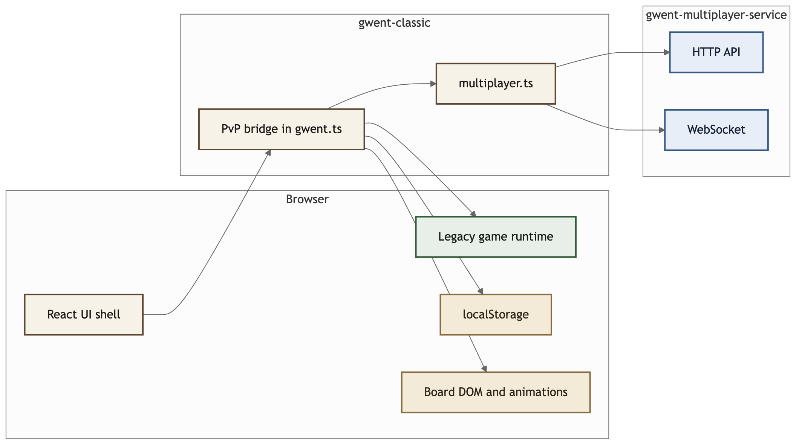

# Frontend Architecture

This document describes the frontend architecture for `gwent-classic`.

## Diagram

## What this frontend owns

- React application shell
- browser UI and DOM updates
- local PvC flow
- deck building and deck serialization
- anonymous local PvP identity
- HTTP and WebSocket communication with the multiplayer service
- replay of visible PvP events through the existing board runtime

## Main code entry points

1. [`src/app/services/multiplayer.ts`](/Users/dush/Gwent/gwent-classic/src/app/services/multiplayer.ts)
2. [`src/gwent.ts`](/Users/dush/Gwent/gwent-classic/src/gwent.ts)

## Runtime model

The frontend has two gameplay modes:

- `PvC`
  - all gameplay logic stays in the browser
- `PvP`
  - the backend is authoritative
  - the frontend renders player-scoped state and replays visible transitions

## Snapshot model

The current PvP client is hybrid:

- snapshots are the source of truth
- event logs are used to replay supported transitions
- the board is reconciled from the latest player-scoped snapshot when needed

This is what allows bootstrap, reconnect, and refresh recovery while PvP presentation parity is still being completed.
